<p align="center">
  
</p>

<h1 align="center">Prismedia</h1>

<p align="center">
  <strong>A private, self-hosted media library for the whole household.</strong>
  <br />
  Video-first, with first-class images, galleries, books, comics, audio, people, studios, tags, collections, plugins, and file management.
</p>

<p align="center">
  <a href="https://pauljoda.github.io/Prismedia/">
    
  </a>
  <a href="https://pauljoda.github.io/Prismedia/docs/users/quick-start">
    
  </a>
  <a href="https://github.com/pauljoda/Prismedia/pkgs/container/prismedia">
    
  </a>
</p>

<p align="center">
  <a href="https://pauljoda.github.io/Prismedia/">Docs</a> &middot;
  <a href="#quick-start">Quick Start</a> &middot;
  <a href="#what-prismedia-manages">Features</a> &middot;
  <a href="#development">Development</a> &middot;
  <a href="https://www.reddit.com/r/Prismedia/">Subreddit</a>
</p>

<p align="center">
  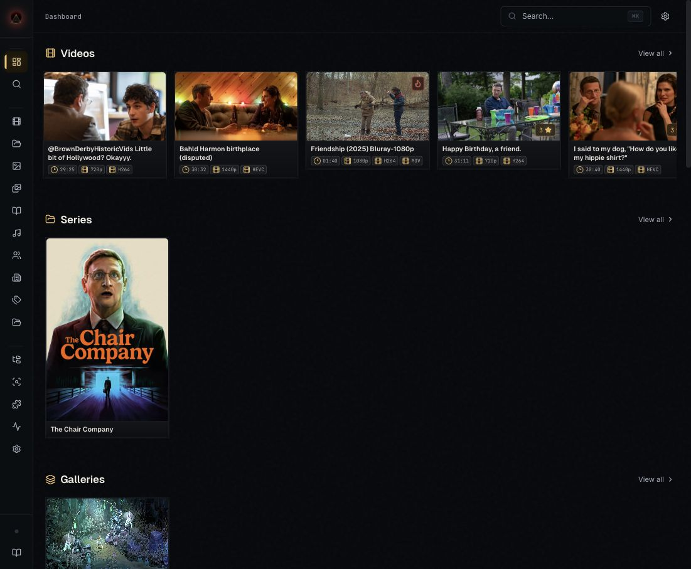
</p>

## What Is Prismedia?

Prismedia is a private media library for self-hosted collections. It is optimized for a single trusted user or household on a private LAN: mount your media, open a browser, and browse from your phone, tablet, desktop, or TV browser.

The production image is intentionally simple. PostgreSQL 16, ffmpeg, the .NET API, the .NET worker, and the built Svelte frontend all ship together as one Docker image. Application data lives in `/data`; your library lives under `/media`; the web app listens on port `8008`.

Prismedia owns its own library model. Stash-compatible plugins and StashBox metadata are supported for discovery and identification workflows, but Prismedia's schema, UI, and release process are built around its own media entities.

## Quick Start

### Docker Run

```bash
docker run -d \
  --name prismedia \
  -p 8008:8008 \
  -v prismedia-data:/data \
  -v /path/to/your/media:/media \
  ghcr.io/pauljoda/prismedia:latest
```

Open [http://localhost:8008](http://localhost:8008), add `/media` or one of its subfolders as a watched library, then run a scan from **Jobs** or **Settings**.

### Docker Compose

```yaml
services:
  prismedia:
    image: ghcr.io/pauljoda/prismedia:latest
    ports:
      - "8008:8008"
    volumes:
      - prismedia-data:/data
      - /path/to/your/media:/media
    restart: unless-stopped

volumes:
  prismedia-data:
```

```bash
docker compose up -d
```

### Volumes

| Mount | Purpose |
| --- | --- |
| `/data` | PostgreSQL data, generated cache, thumbnails, waveforms, trickplay, HLS output, plugin state |
| `/media` | Your mounted media folders |

Mount `/media` read-only if Prismedia should only scan and play files. Mount it read-write if you want browser uploads, renames, moves, deletes, and file-manager organization.

### Image Tags

| Tag | Use |
| --- | --- |
| `latest` | Current promoted release. Recommended for normal installs. |
| `release` / `release-X.Y.Z` | Release channel and version-pinned release images. |
| `beta` / `beta-X.Y.Z` | Manual beta channel for release candidates. |
| `alpha` / `alpha-X.Y.Z` | Manual alpha channel for early testing. |
| `dev` | Latest `main` build. Useful for testing fixes before release. |
| `sha-<short-sha>` / `X.Y.Z-<short-sha>` | Exact dev build for rollback or bisection. |

Read [CHANGELOG.md](CHANGELOG.md) before upgrading a library you care about.

## What Prismedia Manages

### Library And Search

Prismedia has dedicated browse surfaces for videos, series, images, galleries, books, audio, people, studios, tags, and collections. The dashboard gives you recent activity and library health; the search page and command palette jump across every entity type.

<p align="center">
  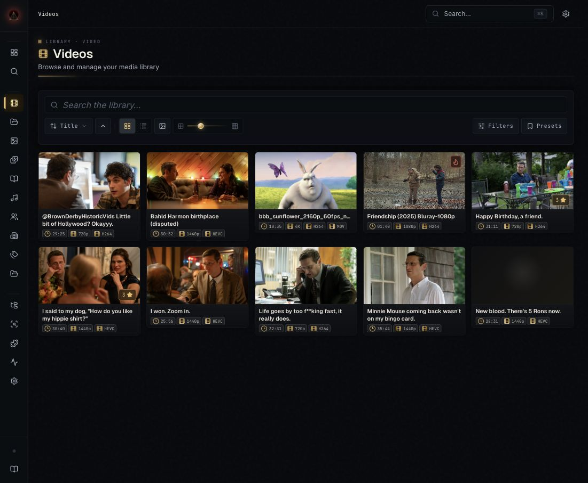
  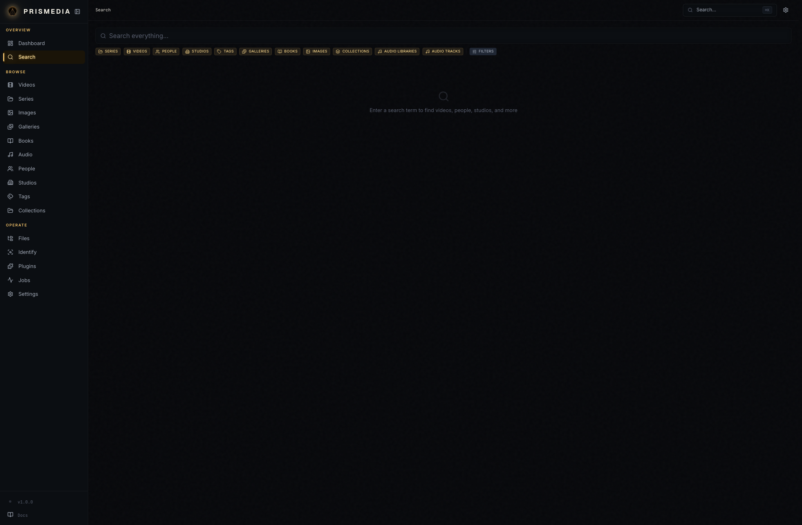
</p>

### File Manager

The **Files** workspace mirrors watched library roots and gives you practical file operations without leaving the app: open linked entities, create folders, upload, rename, move, rescan, exclude paths from scans, remove exclusions, and delete when the media mount is writable.

<p align="center">
  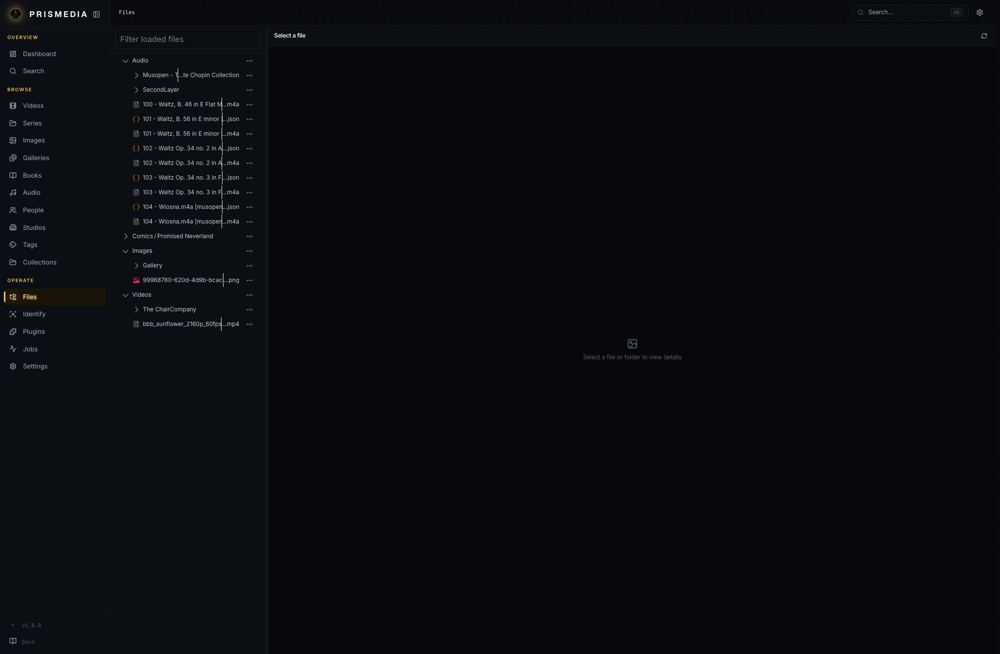
</p>

### Playback And Reading

Videos stream directly when the browser can play them and fall back to on-demand HLS when they need transcoding. Detail pages include subtitles, transcript management, trickplay previews, resume state, metadata editing, and artwork controls.

Books and comics open in a dedicated reader with paged and vertical reading modes. Images and galleries use a lightbox with metadata and linked entities. Audio libraries provide album-style track lists, waveforms, and a persistent player.

<p align="center">
  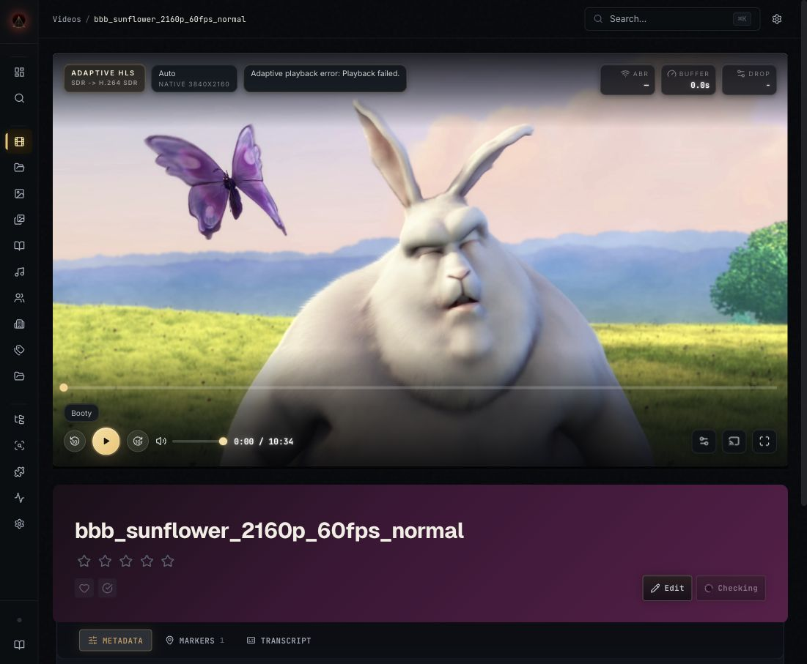
  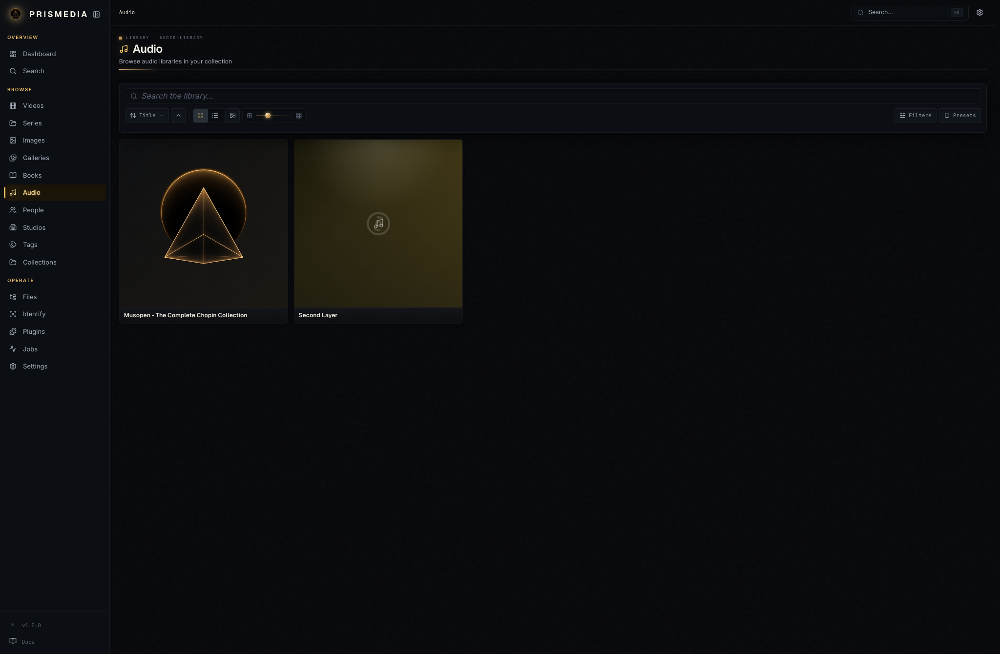
</p>

### Metadata And Identify

The Identify workspace keeps a durable review queue. Add videos, series, books, galleries, images, people, or studios, run providers, review field-by-field proposals, choose artwork, walk into child proposals, and accept when the result is right.

Plugins can be native TypeScript, Python, or Stash-compatible scraper packages. StashBox endpoints are available for fingerprint lookup and contribution workflows.

<p align="center">
  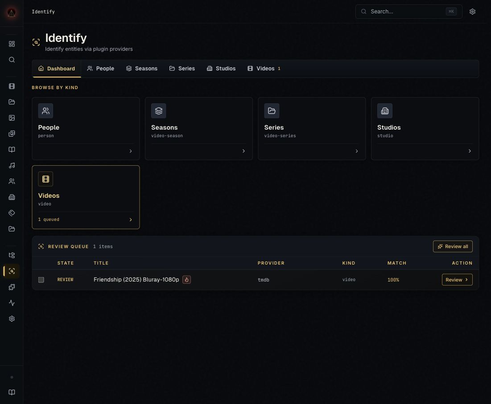
  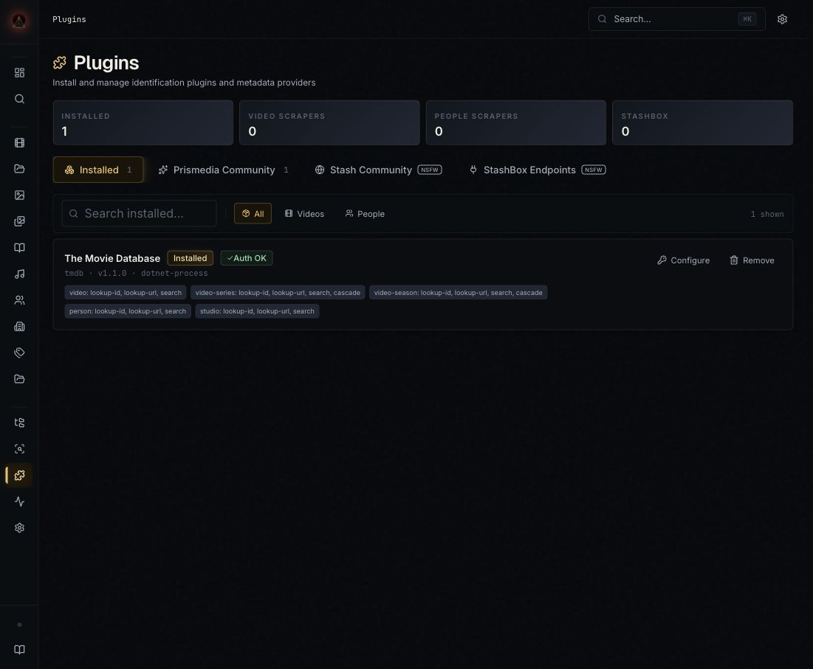
</p>

### Collections

Collections are simple groupings for browsing and curation. They can be manual, rule-driven, or hybrid, and they can contain videos, series, galleries, images, books, and audio tracks. They are not a global playback queue; they are an organizational view over your library.

<p align="center">
  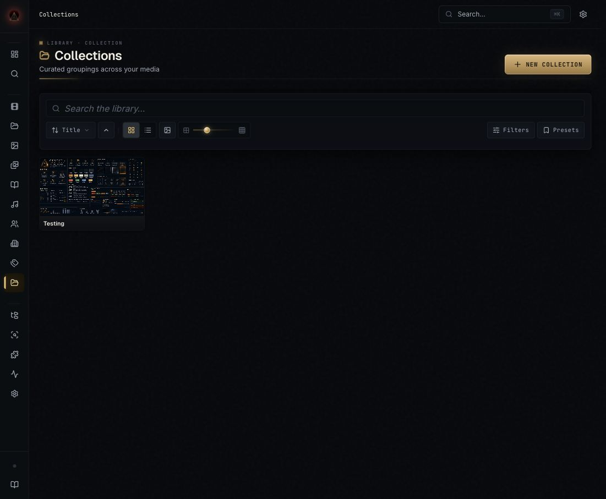
</p>

### Jobs, Settings, And Visibility

Long-running work runs in the .NET worker and is visible in **Jobs**: scans, probes, previews, thumbnails, sprites, HLS, subtitles, identify, imports, collection refreshes, and maintenance. Settings control watched libraries, NSFW visibility, playback, subtitles, generated storage, worker concurrency, and diagnostics.

<p align="center">
  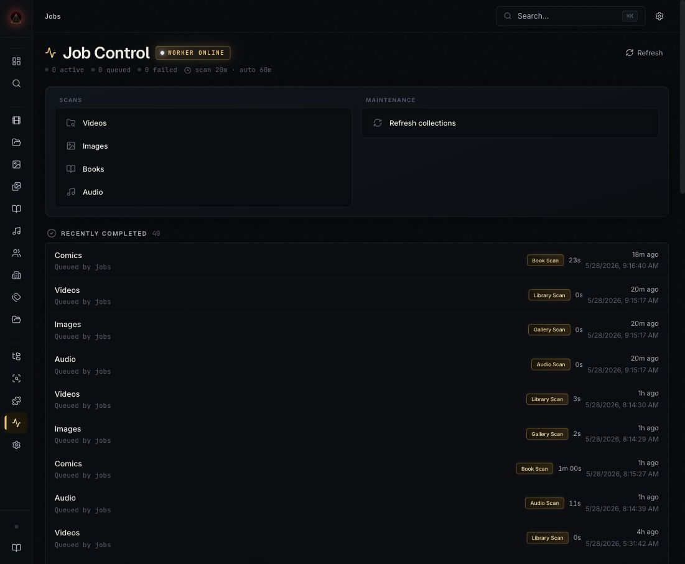
  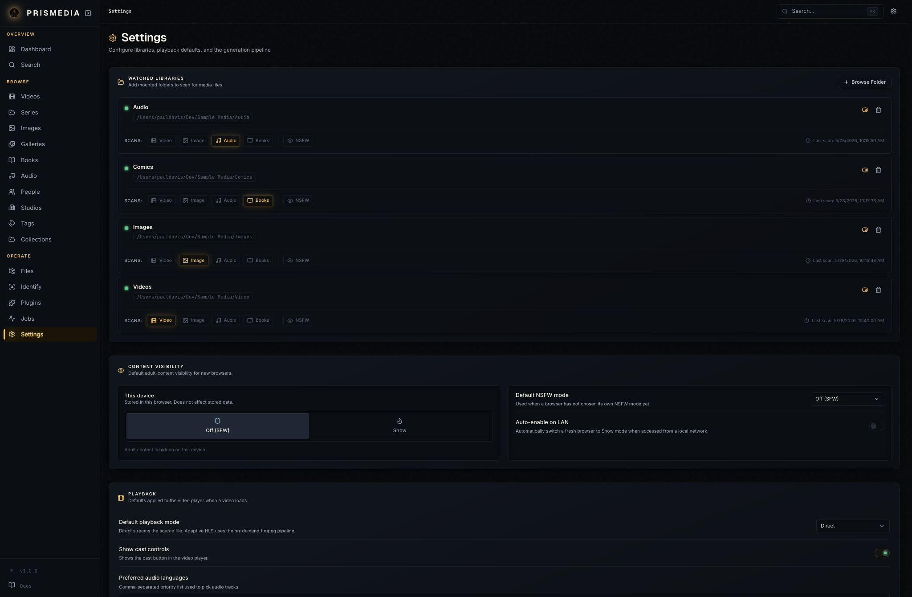
</p>

### Mobile

The Svelte frontend is mobile-first. Navigation, entity grids, detail pages, readers, lightboxes, and the audio player are designed to work from a phone without relying on hover-only actions.

<p align="center">
  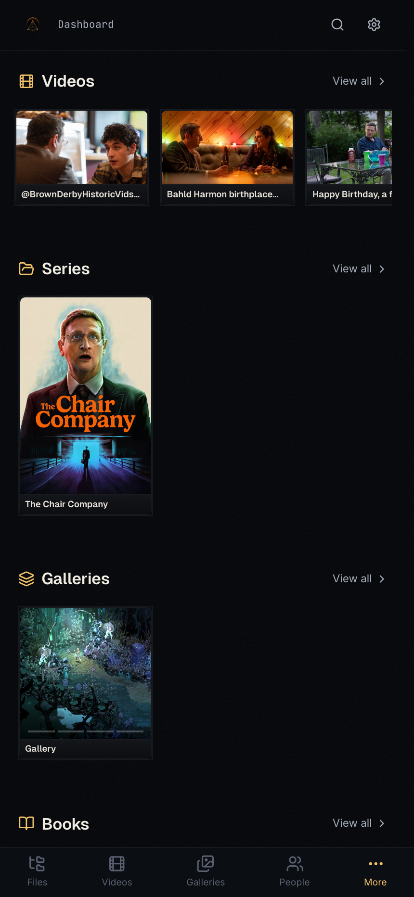
  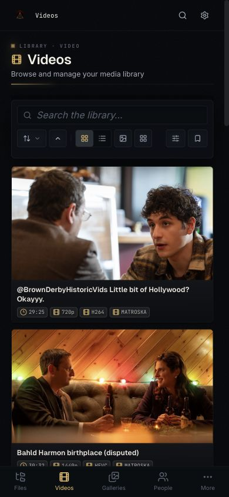
  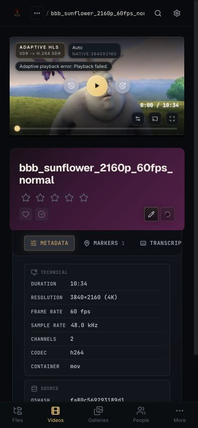
  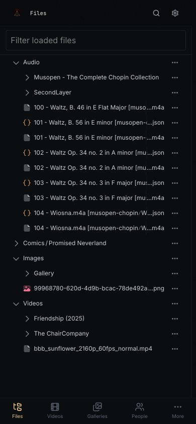
</p>

## Design Language

Prismedia follows **Prism Noir Luxe**: dark material surfaces, glass only for floating or interactive layers, controlled radii, brass glow for active state, Cinzel/Geist/Inter/JetBrains Mono type voices, and dense layouts that stay usable on touch screens.

The design language lives in [docs/design-language.md](docs/design-language.md) and is mirrored in the [documentation site](https://pauljoda.github.io/Prismedia/docs/developers/design-language).

## Documentation

- [Quick Start](https://pauljoda.github.io/Prismedia/docs/users/quick-start)
- [First Boot](https://pauljoda.github.io/Prismedia/docs/users/first-boot)
- [Browsing The Library](https://pauljoda.github.io/Prismedia/docs/users/browsing)
- [Library Organization](https://pauljoda.github.io/Prismedia/docs/users/library-organization)
- [Playback](https://pauljoda.github.io/Prismedia/docs/users/playback)
- [Identify And Plugins](https://pauljoda.github.io/Prismedia/docs/users/identify-and-scrape)
- [Architecture](https://pauljoda.github.io/Prismedia/docs/developers/architecture)

## Development

### Prerequisites

- Node.js 22
- pnpm 10.30.3
- .NET 10 SDK
- Docker
- ffmpeg for media work outside the unified image

### Local Stack

```bash
pnpm install
docker compose -f infra/docker/docker-compose.yml up -d postgres
pnpm --filter @prismedia/web-svelte dev
dotnet run --project apps/backend/src/Prismedia.Api/Prismedia.Api.csproj
dotnet run --project apps/backend/src/Prismedia.Worker/Prismedia.Worker.csproj
```

Vite runs at [http://localhost:5173](http://localhost:5173) and proxies API calls to the .NET API at [http://localhost:8008](http://localhost:8008).

### Useful Commands

```bash
pnpm check          # frontend lint/typecheck through turbo
pnpm test:unit      # TypeScript unit tests
pnpm test:web-svelte
pnpm test:backend   # .NET tests
pnpm docs:check     # Docusaurus typecheck + build
pnpm release:check  # changelog + workspace version validation
```

### Build The Production Image

```bash
docker build -f infra/docker/unified.Dockerfile -t prismedia:local .
```

## Release Notes

Prismedia starts at `1.0.0` and uses plain SemVer versions. The root `package.json` is the build version and all workspace package versions must match it. Channel publishing never edits package versions or changelog headings; it only publishes the already-decided build.

See [CHANGELOG.md](CHANGELOG.md) for user-facing release notes.

## License

See [LICENSE](LICENSE).
